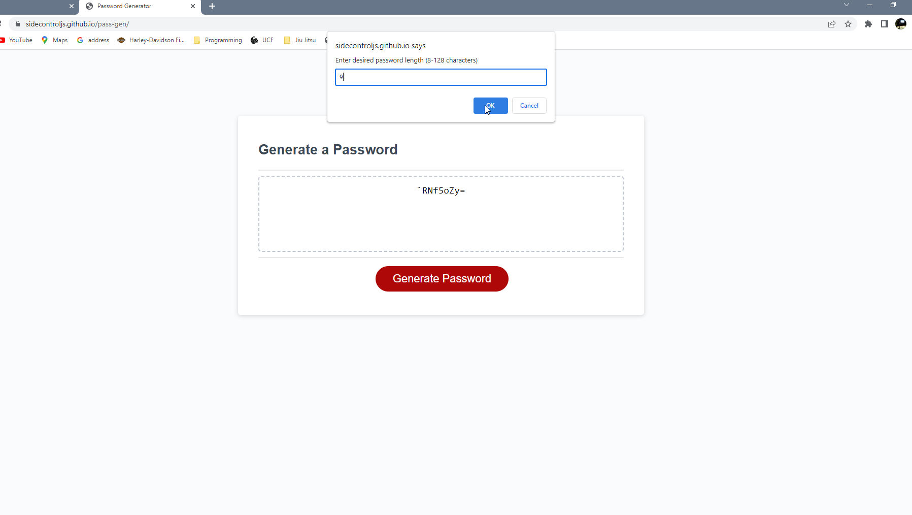
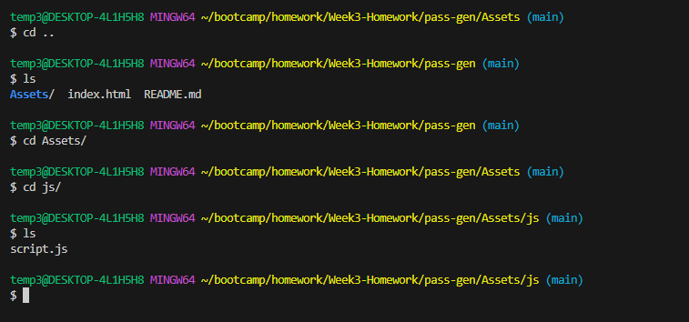

# My Portfolio

## Description
For this project, I needed to make sure that this page was able to generate a random, secure, password for employees. I used JavaScript to complete this. I was able to learn more about pseudo coding, variables, functions, for loops, and if statements. I also learned how the 'confirm' and 'prompt' functions work, and also how to convert string data to number data. I needed to do this in order for my user defined password length to be converted to it's representative number. For example, if a user inputs that they want their password to be 12 characters long, I used the !Number.isInteger(length) function for this. This took me some time to figure out but ultimately helped me learn something new! 

## Link to Deployed Page

https://sidecontroljs.github.io/pass-gen/

## Screenshots of Deployed Webpage

## Local Repo Screenshot

## Credits
I used this README template: 
https://coding-boot-camp.github.io/full-stack/github/professional-readme-guide

I read through these pages and videos to help me with this Challenge:
https://developer.mozilla.org/en-US/docs/Web/JavaScript/Reference/Statements/var
https://developer.mozilla.org/en-US/docs/Web/JavaScript/Guide/Functions
https://developer.mozilla.org/en-US/docs/Web/JavaScript/Guide/Loops_and_iteration
https://developer.mozilla.org/en-US/docs/Web/JavaScript/Reference/Statements/if...else
https://developer.mozilla.org/en-US/docs/Web/JavaScript/Reference/Global_Objects/Number/isInteger
https://www.w3schools.com/jsref/met_element_addeventlistener.asp

I watched these videos about other password generators:
https://youtu.be/duNmhKgtcsI
https://youtu.be/eepZz8C60RU
https://youtu.be/7aup9L3TOss